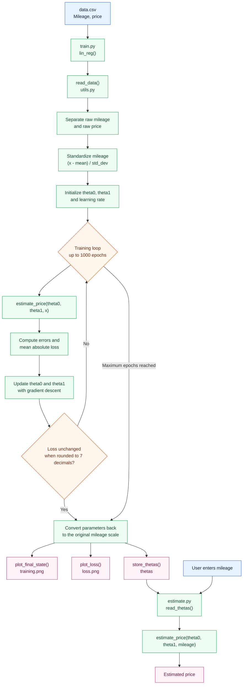

# Linear Regression Flow

## Files involved

- `data.csv`: training data.
- `train.py`: model initialization, training, plotting, and theta persistence.
- `utils.py`: data loading and plot generation.
- `thetas`: persisted model parameters.
- `estimate.py`: price estimation from a user-provided mileage.
